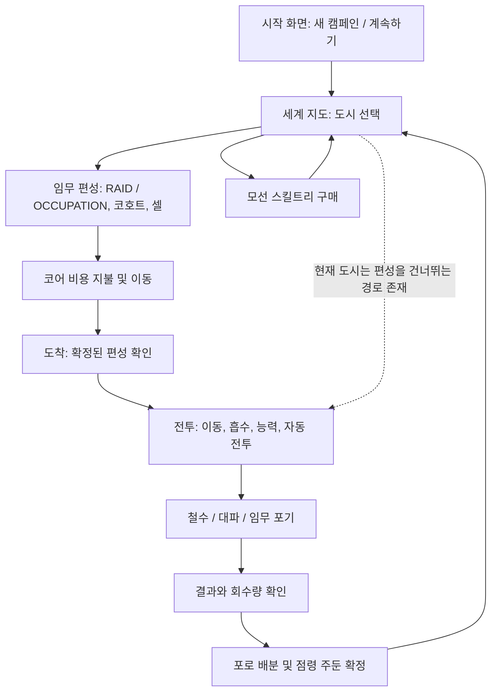

# 게임 전체 구성

**작성일: 2026-08-27 · 최종 수정일: 2026-08-27**

**변경 이력**

| 날짜 | 구분 | 내용 |
| --- | --- | --- |
| 2026-08-27 | 수정 | 작성일·최종 수정일·변경 이력 추가 |
| 2026-08-27 | 작성 | 전체 게임 구성·플레이 흐름·기능 상태·용어 정리 |

기준: 2026-08-27 / `084d4c3`. [문서 안내](README.md) · [개선 목록](GAPS.md)

## 1. 게임의 형태와 목적

**They Call It Earth**는 외계 모선을 조작해 지구 도시에서 인원·물자를 흡수하고, 획득 자원으로 모선과 지상 병력을 성장시키는 싱글 플레이 웹 게임이다. 전략 화면은 React 세계 지도, 전투 화면은 Babylon.js의 고정 측면 2.5D다.

장기 목표로 구현된 계산은 **플레이 가능 도시 8곳의 점령**이다. 지도에 점령 수와 비율이 표시되지만, 8곳 완료 후 엔딩·다음 캠페인으로 넘어가는 흐름은 없다. 이야기 챕터, 보스전, 스테이지별 보상표, 별 등급 체계도 현재 실행 경로에는 없다.

근거: [GameApp](../src/game/GameApp.tsx), [도시 목록](../src/game/data/playableCities.ts), [승리 진행 계산](../src/game/domain/campaignRules.ts)의 `getCampaignVictoryProgress`, [세계 지도](../src/game/presentation/screens/WorldMapScreen.tsx).

## 2. 플레이의 큰 흐름

마지막 점선은 의도된 권장 루프가 아니라 현재 UI의 예외다. 같은 도시에서 다시 편성·점령 임무를 선택하기 어렵다. [SYS-004](GAPS.md#sys-004)

한 전투의 기본 흐름은 **흡수 지점으로 이동 → 자동 탐지 → 흡수와 방어 → 75초 생존 → 3초 철수**다. RAID의 성공에는 흡수량 25,000 이상이 추가로 필요하고, OCCUPATION에는 시설 파괴·거점 확보·병력 생존이 필요하다. 생존 시간 충족은 성공 판정과 다르다.

## 3. 무엇이 열려 있는가

| 구분 | 현재 동작 |
| --- | --- |
| 도시 콘텐츠 | 데이터는 8개 권역·50개 국가·259개 도시. 실제 출격 허용은 8개 ID의 고정 목록이다. |
| 도시 해금 | 서울·도쿄·뉴욕·런던·상하이·파리·두바이·카이로는 처음부터 선택 가능하다. 나머지는 전투를 해도 열리지 않는다. |
| 스테이지 / 주기 | `completedBattles + 1`. 홀수는 밤, 짝수는 낮. 성공뿐 아니라 부분 성공·대파·포기도 횟수에 포함된다. |
| 점령 임무 | 해당 도시가 `BREACHED`, `OCCUPIED`, `ASSIMILATED`일 때 편성 화면에서 선택 가능하다. |
| 능력 | 흡수·EMP·플라즈마·오버드라이브·자동 방어는 처음부터 존재한다. 능력 해금용 연구는 없다. |
| 연구 | 6개 분기, 26개 노드, 모두 최대 3레벨. 자원과 선행 노드 조건으로 구매한다. |
| 병종 | 생성·편성 가능한 것은 `ASSAULT`뿐이다. `SABOTEUR`·`HARVEST`는 타입·번역만 남아 있다. |

데이터의 `mapTier`는 지도 표시용 구분이다. 도시의 방어·자원·기술 등급은 수치 계산에 쓰이며 순차 스테이지 해금 조건이 아니다. 도시별 정확한 대응은 [캠페인 문서](CAMPAIGN.md)에 있다.

## 4. 시스템별 구현 상태

| 시스템 | 상태 | 현재 범위 / 주의점 |
| --- | --- | --- |
| 시작·계속하기·저장 초기화 | 구현 | 브라우저 로컬 저장 하나. 새 캠페인·삭제 전 별도 확인창 없음 |
| 세계 지도·이동 | 구현 / 흐름 문제 | 팬·줌·국가·도시 상세, 이동 비용·애니메이션. 확정 임무 취소와 현재 도시 재편성 미비 |
| 도시 파괴·자원 소모 | 부분 구현 | 시설과 종류별 자원 풀 저장. 새 방공호·외부 군중이 유기물 풀 제한을 우회 |
| 흡수와 화물 | 구현 | 열·에너지·수량·잠금 조건 적용. UI에는 열과 중단 사유가 충분히 노출되지 않음 |
| 방공·요격·지상 드론 | 구현 | 실제 상태에 피해·요격 결과 반영. 화면 효과만 있는 기능과 구분 필요 |
| 코호트 자동 전투·점령 | 구현 / 일부 불완전 | 편성 후 자동 배치·공격·거점 확보. 강하 버튼의 연출과 별개 |
| 포로 변환 | 구현 / 오류 | 코호트·바이오매스·예비고로 배분. 예비고 소비 경로와 만고 시 잔여 인원 처리 없음 |
| 코어 충전 | 구현 | 이동 연료 및 셀 구매에 소비. 전투 에너지와 다른 자원 |
| 과충전 셀 | 미연결 | 구매·편성·환급은 남았지만 세 중량 능력의 셀 비용은 0 |
| 스킬트리 | 구현 / 일부 무효 | 선행 조건과 자동 방어 6종도 구현됨. 위협 예측은 현행 HUD·전투에 미연결 |
| 점령 후 운영·엔딩 | 부분 구현 | 점령 수·출발 연료 할인만 연결. 주둔 회수·동화·승리 화면 없음 |
| 전투 연출·음향 | 구현 / 선택적 비활성 | 낮·밤, 피격·폭발·대파·흡수, 선택된 효과음. 꼬리 배기·동적 피난 등 일부 꺼짐 |

상태를 자세히 판단할 때는 [전투](BATTLE.md), [자원·성장](PROGRESSION.md), [오류·누락](GAPS.md)을 함께 읽는다.

## 5. 혼동하기 쉬운 용어

| 용어 | 실제 의미 |
| --- | --- |
| 전투 에너지 `mothership.energy` | 임무 안에서 능력·흡수·요격에 소비하는 게이지. 전투를 시작할 때 최대치로 채움 |
| 코어 충전 `logistics.coreCharge` | 캠페인 이동 자원. POWER 흡수 보상·미사용 셀 환급·긴급 충전으로 획득 |
| 에너지 코어 `energy-core` | 전투 최대 에너지와 비흡수 중 재생량을 늘리는 업그레이드 |
| 코어 저장고 `core-reservoir` | 캠페인 코어 충전의 보관 상한을 늘리는 업그레이드 |
| DATA CORE / RELIC | 흡수 대상의 이름·종류. 즉시 화물 수치로 환산하며 장비 인벤토리에 들어가는 아이템이 아님 |
| 스킬트리 중앙 ‘모선 코어’ | 트리 중심의 시각 요소. 장착·소비할 수 있는 별도 코어 아이템이 아님 |
| 과충전 셀 | 코어 8로 편성하는 보급 수치. 현재 전투 사용처가 끊겨 있음 |
| 코호트 `ASSAULT` | 포로로 생성하고 출격 전에 선택하는 영속 지상 병력 |
| ‘감염 강습부대’ 버튼 `/` | 사람 실루엣 낙하 VFX. 코호트 생성·배치·피해·포로 소비는 하지 않음 |
| 자폭드론 `groundSwarm` | 모선 편의 자동 지상 공격. 적 지상 시설·방어군을 실제로 공격 |

**별도 아이템 인벤토리, 장착 슬롯, 코어 아이템 사용 메뉴는 없다.** 이름에 ‘코어’가 들어간 대상과 실제 사용 가능한 자원을 동일한 아이템 시스템으로 해석하면 안 된다.

## 6. 앞으로의 기획을 다루는 방법

기존 문서의 후속 기획은 [GAPS](GAPS.md)의 ‘보존한 후속 기획’으로 통합했다. 순차 도시 해금, 동화와 엔딩, 병종 확장, 최종 아트, 장비 슬롯 등은 현재 동작 설명에 섞지 않는다. 우선 저장·정산·자원 지속성 오류를 고친 뒤 코어·셀·포로·코호트의 역할을 결정하는 순서가 적절하다.
