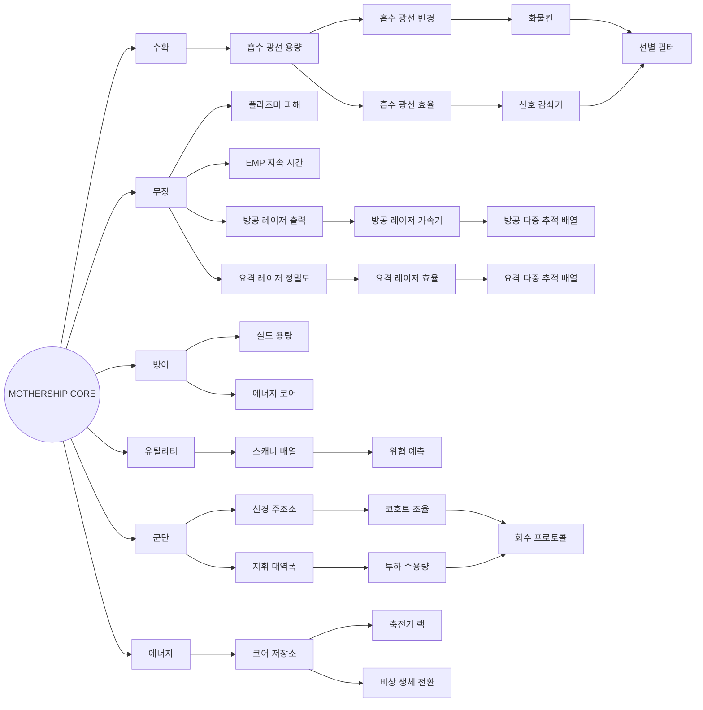

# 모선 업그레이드 스킬트리 맵 개발계획서

> 현재 카드 목록형 업그레이드 화면을 연결형 스킬트리 맵으로 재구성하기 위한 개발계획서다.
> 기존 업그레이드 20종과 신규 자동 방어 무기 업그레이드 6종을 하나의 26노드 트리로 통합한다.

## 문서 메타데이터

| 항목 | 내용 |
|---|---|
| 문서 상태 | 1차 구현 완료 |
| 기준일 | 2026-08-26 |
| 기준 기획 | [`MOTHERSHIP_UPGRADE_RESEARCH.md`](./MOTHERSHIP_UPGRADE_RESEARCH.md) |
| 구현 이슈 | [`MOTHERSHIP_UPGRADE_IMPLEMENTATION_MISMATCHES.md`](./MOTHERSHIP_UPGRADE_IMPLEMENTATION_MISMATCHES.md) |
| 대상 화면 | `UpgradeScreen` |
| 대상 노드 | 현재 20종 + 신규 6종 = 26종 |

## 구현 결과 (2026-08-26)

- 26개 업그레이드 카탈로그와 6개 분기 트리 데이터 분리 완료
- 선행 조건, 잠금 상태, 기존 보유 노드 호환 구매 규칙 구현 완료
- 방공·요격 레이저의 피해·주기·정밀도·효율·다중 타깃 적용 완료
- 플라즈마 전투기 피해와 EMP 확률 무력화 적용 완료
- 다중 발사 이벤트 배열과 VFX 소비 구조 적용 완료
- 팬·줌·분기 포커스·상세 패널을 포함한 스킬트리 화면 구현 완료
- 한국어·영어 문구와 이전 세이브 호환 확인 완료
- 타입 검사, 전체 단위 테스트, 프로덕션 빌드, 데스크톱·모바일 화면 검증 완료

## 1. 개발 목표

현재 업그레이드 화면의 독립 카드 20개를 단순 나열하는 구조에서 벗어나, 업그레이드 간 관계와 성장 방향을 한눈에 이해할 수 있는 스킬트리 맵으로 변경한다.

핵심 목표는 다음과 같다.

- 업그레이드를 수확, 무장, 방어, 유틸리티, 군단, 에너지의 6개 분기로 시각화
- 노드와 연결선으로 선행 조건 표현
- 기존 3레벨 업그레이드 구조 유지
- 현재 구매 비용과 자원 경제 유지
- 신규 방공·요격 레이저 업그레이드 6종 추가
- 플라즈마 전투기 피해와 EMP 전투기 무력화 기획 반영
- 다중 타깃 공격을 처리할 수 있도록 전투 이벤트와 VFX 구조 확장
- 기존 세이브의 업그레이드 레벨을 손실 없이 유지

## 2. 개발 범위

### 2.1 포함 범위

- 스킬트리 데이터 모델과 노드 그래프 정의
- 선행 조건과 잠금 상태 계산
- 서버가 없는 현재 구조에 맞춘 도메인 구매 검증
- 팬·줌이 가능한 스킬트리 맵 UI
- 선택 노드 상세 정보와 구매 패널
- 기존 20종 업그레이드의 트리 배치
- 신규 6종 업그레이드 정의와 전투 보정값 연결
- 방공·요격 레이저 다중 타깃 처리
- 플라즈마 전투기 피해 처리
- EMP 전투기 확률 무력화 처리
- 한국어·영어 콘텐츠
- 저장 호환, 단위 테스트, 전투 테스트, 화면 검증

### 2.2 제외 범위

- 업그레이드 환불 또는 전체 초기화
- 분기 선택에 따른 다른 분기 영구 잠금
- 별도 스킬 포인트 재화
- 업그레이드에 따른 3D 모선 외형 교체
- 온라인 동기화
- 런타임에서 사용자가 노드 위치를 편집하는 기능

위 항목은 스킬트리 MVP가 안정화된 뒤 별도 기획으로 검토한다.

## 3. 현재 구조와 변경 방향

### 3.1 현재 구조

- `UPGRADE_DEFINITIONS` 배열을 순서대로 카드로 출력
- 모든 카드가 처음부터 표시되고 구매 가능
- 업그레이드 간 선행 조건 없음
- `purchaseUpgrade()`가 비용과 최대 레벨만 검증
- `CampaignState.upgrades`에 ID별 레벨 저장
- 자동 방어 무기는 업그레이드 정의가 없음
- 방공·요격 레이저 발사 이벤트는 각각 마지막 이벤트 하나만 저장

### 3.2 목표 구조

- 업그레이드 정의와 트리 배치·연결 데이터를 분리
- 노드 상태를 `LOCKED`, `AVAILABLE`, `OWNED`, `MAXED`로 계산
- 연결선이 선행 조건 충족 여부를 표시
- 노드 선택 시 우측 상세 패널에서 효과·비용·선행 조건·다음 레벨 확인
- 구매 가능 여부를 UI와 도메인 규칙 양쪽에서 검증
- 다중 타깃 발사를 위해 단일 이벤트 필드를 이벤트 배열로 교체

## 4. 스킬트리 정보 구조

### 4.1 공통 규칙

- 중앙의 `MOTHERSHIP CORE`는 구매하지 않는 시각적 허브다.
- 6개 분기 허브도 구매하지 않으며 각 계열의 시작점을 표시한다.
- 각 업그레이드 노드는 기존과 동일하게 최대 3레벨이다.
- 기본 시작 노드는 선행 조건 없이 구매할 수 있다.
- 일반 연결은 부모 노드 1레벨 달성 시 자식 노드를 해금한다.
- 합류 노드와 다중 타깃 최종 노드는 지정 부모 2레벨을 요구한다.
- 이미 1레벨 이상 보유한 노드는 선행 조건이 부족해도 기존 세이브 보호를 위해 계속 업그레이드할 수 있다.
- 자식 노드를 구매한 뒤 부모 레벨을 낮추는 기능은 MVP에 없으므로 역방향 무효화는 고려하지 않는다.

### 4.2 권장 트리 구조



### 4.3 노드별 선행 조건

| 분기 | 노드 | 선행 조건 |
|---|---|---|
| 수확 | `beam-capacity` | 없음 |
| 수확 | `beam-radius` | `beam-capacity` 1레벨 |
| 수확 | `beam-efficiency` | `beam-capacity` 1레벨 |
| 수확 | `cargo-bay` | `beam-radius` 1레벨 |
| 수확 | `signature-dampener` | `beam-efficiency` 1레벨 |
| 수확 | `selective-filter` | `cargo-bay` 2레벨 + `signature-dampener` 2레벨 |
| 무장 | `plasma-damage` | 없음 |
| 무장 | `emp-duration` | 없음 |
| 무장 | `air-defense-damage` | 없음 |
| 무장 | `air-defense-cycle` | `air-defense-damage` 1레벨 |
| 무장 | `air-defense-multitarget` | `air-defense-cycle` 2레벨 |
| 무장 | `point-defense-accuracy` | 없음 |
| 무장 | `point-defense-efficiency` | `point-defense-accuracy` 1레벨 |
| 무장 | `point-defense-multitarget` | `point-defense-efficiency` 2레벨 |
| 방어 | `shield-capacity` | 없음 |
| 방어 | `energy-core` | 없음 |
| 유틸리티 | `scanner-array` | 없음 |
| 유틸리티 | `threat-forecast` | `scanner-array` 1레벨 |
| 군단 | `neural-foundry` | 없음 |
| 군단 | `cohort-conditioning` | `neural-foundry` 1레벨 |
| 군단 | `command-bandwidth` | 없음 |
| 군단 | `drop-capacity` | `command-bandwidth` 1레벨 |
| 군단 | `recovery-protocol` | `cohort-conditioning` 1레벨 + `drop-capacity` 1레벨 |
| 에너지 | `core-reservoir` | 없음 |
| 에너지 | `capacitor-rack` | `core-reservoir` 1레벨 |
| 에너지 | `emergency-bio-conversion` | `core-reservoir` 1레벨 |

`signature-dampener`는 현재 유틸리티 그룹이지만 흡수 광선과 직접 연결된 효과이므로 스킬트리에서는 수확 분기로 이동한다. 데이터상의 효과 그룹과 화면상의 트리 분기는 별도 필드로 관리한다.

## 5. 화면 설계

### 5.1 기본 레이아웃

```text
┌──────────────────────────────────────────────────────────────┐
│ 상단 바: 뒤로가기 · 보유 자원 · 트리 진행도 · 화면 맞춤     │
├───────────────┬──────────────────────────────┬───────────────┤
│ 분기 범례     │                              │ 선택 노드     │
│ 수확          │      팬·줌 스킬트리 맵       │ 이름/레벨     │
│ 무장          │      노드 + 연결선           │ 효과/비용     │
│ 방어          │                              │ 선행 조건     │
│ 유틸리티      │                              │ INSTALL       │
│ 군단/에너지   │                              │               │
└───────────────┴──────────────────────────────┴───────────────┘
```

좁은 모바일 가로 화면에서는 분기 범례를 상단 필터로 축소하고, 상세 패널을 우측 오버레이 또는 하단 시트로 전환한다.

### 5.2 노드 표현

각 노드는 다음 정보를 짧게 표시한다.

- 업그레이드 아이콘 또는 계열별 심볼
- 축약 이름
- 현재 레벨 `0/3`~`3/3`
- 구매 가능 여부
- 다음 레벨 비용을 나타내는 자원 아이콘

노드 전체 설명은 맵에 직접 표시하지 않고 선택 상세 패널에서 제공한다.

### 5.3 노드 상태

| 상태 | 표현 | 동작 |
|---|---|---|
| `LOCKED` | 어둡게 표시, 잠금 아이콘, 미충족 연결선 | 선택 가능, 구매 불가, 필요한 부모 레벨 표시 |
| `AVAILABLE` | 분기 색상 테두리와 약한 펄스 | 선택 및 구매 가능 |
| `OWNED` | 활성 연결선, 채워진 레벨 핍 | 다음 레벨 구매 가능 |
| `MAXED` | 강한 발광, 완료 마크 | 선택 가능, 구매 버튼 대신 최대 레벨 표시 |
| `INSUFFICIENT` | 구매 가능 상태지만 비용 영역 경고색 | 선택 가능, 자원 부족 안내 |

`INSUFFICIENT`는 도메인 노드 상태가 아니라 `AVAILABLE` 또는 `OWNED`에 추가되는 UI 보조 상태로 구현한다.

### 5.4 연결선

- 잠긴 연결선: 낮은 명도와 점선
- 해금 가능한 연결선: 분기 색상과 약한 흐름 애니메이션
- 충족된 연결선: 실선과 발광
- 합류 노드: 필요한 모든 연결이 충족돼야 활성화
- 감소된 움직임 설정에서는 흐름 애니메이션 제거

### 5.5 맵 조작

- 마우스 드래그로 이동
- 휠로 확대·축소
- 터치 드래그와 핀치 줌
- `+`, `-`, `화면 맞춤`, `선택 노드 중앙 정렬` 버튼
- 분기 이름 선택 시 해당 분기로 카메라 이동
- 화면 진입 시 보유 업그레이드가 가장 많은 분기 또는 중앙 허브가 보이도록 자동 맞춤
- 확대 범위는 약 0.55~1.6으로 제한

### 5.6 접근성

- 모든 구매 노드는 실제 `<button>` 요소 사용
- 키보드 방향키로 인접 노드 이동
- `Enter`로 상세 열기, 상세 패널에서 구매
- 노드 `aria-label`에 이름, 현재 레벨, 상태, 선행 조건 포함
- SVG 연결선은 장식 요소로 처리하고 상태 정보는 노드 설명에도 제공
- 색상만으로 상태를 구분하지 않고 아이콘·선 종류·텍스트 병행

## 6. 데이터 모델 개발

### 6.1 업그레이드 정의 분리

현재 `campaignRules.ts` 안에 있는 `UPGRADE_DEFINITIONS`를 독립 파일로 이동한다.

```ts
export type UpgradeId =
  | 'beam-capacity'
  | 'beam-radius'
  // 기존 ID
  | 'air-defense-damage'
  | 'air-defense-cycle'
  | 'air-defense-multitarget'
  | 'point-defense-accuracy'
  | 'point-defense-efficiency'
  | 'point-defense-multitarget';

export interface UpgradeDefinition {
  id: UpgradeId;
  effectGroup: UpgradeEffectGroup;
  maxLevel: 3;
  cost(level: number): ResourceWallet;
}
```

표시 이름과 설명은 기존 한국어·영어 콘텐츠 시스템을 계속 사용한다.

### 6.2 트리 정의

```ts
export interface UpgradeRequirement {
  id: UpgradeId;
  minimumLevel: number;
}

export interface UpgradeTreeNodeDefinition {
  id: UpgradeId;
  branch: UpgradeTreeBranch;
  position: { x: number; y: number };
  requirements: UpgradeRequirement[];
}

export interface UpgradeTreeDefinition {
  version: 1;
  worldSize: { width: number; height: number };
  nodes: UpgradeTreeNodeDefinition[];
}
```

노드 위치는 자동 배치하지 않고 논리 좌표로 직접 작성한다. 26노드는 규모가 작고 아트 디렉션이 중요하므로 별도 그래프 라이브러리 없이 DOM 노드와 SVG 연결선 조합으로 구현하는 것이 적합하다.

### 6.3 트리 검증기

개발 모드와 테스트에서 다음 오류를 즉시 검출한다.

- 중복 노드 ID
- 존재하지 않는 선행 노드 참조
- 자기 자신을 요구하는 노드
- 순환 의존성
- 최대 레벨보다 높은 선행 레벨
- 트리에 포함되지 않은 업그레이드 정의
- 업그레이드 정의가 없는 트리 노드
- 맵 영역 밖의 노드 좌표

### 6.4 노드 상태 계산

도메인에 다음 함수를 추가한다.

```ts
getUpgradeNodeState(campaign, nodeId): 'LOCKED' | 'AVAILABLE' | 'OWNED' | 'MAXED'
getMissingUpgradeRequirements(campaign, nodeId): UpgradeRequirement[]
canPurchaseUpgrade(campaign, nodeId): CommandResult
```

`purchaseUpgrade()`는 비용 검증 전에 선행 조건을 검증한다. UI에서 버튼을 비활성화하더라도 도메인 함수만 직접 호출해서 잠긴 노드를 구매할 수 없어야 한다.

## 7. 신규 무기 업그레이드 전투 연결

### 7.1 전투 보정값

`CombatModifiers`에 다음 값을 추가한다.

| 보정값 | 계산 |
|---|---|
| `airDefenseDamageMultiplier` | `1 + air-defense-damage 레벨 × 0.20` |
| `airDefenseIntervalMultiplier` | `1 - air-defense-cycle 레벨 × 0.10` |
| `airDefenseTargetCount` | `1 + air-defense-multitarget 레벨` |
| `pointDefenseSuccessChance` | `0.75 + point-defense-accuracy 레벨 × 0.05` |
| `pointDefenseEnergyCost` | `8 - point-defense-efficiency 레벨` |
| `pointDefenseTargetCount` | `1 + point-defense-multitarget 레벨` |
| `empFighterDisableChance` | `0.10 + emp-duration 레벨 × 0.02` |
| `empFighterDisableMaxTargets` | `1 + emp-duration 레벨` |

기존 `airDefenseLaserIntervalMultiplier`는 `airDefenseIntervalMultiplier`로 이름을 정리하고 하드코딩된 1을 제거한다.

### 7.2 방공 레이저 다중 타깃

현재 가장 가까운 전투기 하나만 찾는 로직을 다음 순서로 변경한다.

1. 살아 있고 무력화되지 않은 전투기 수집
2. 모선과 거리순 정렬
3. `airDefenseTargetCount`만큼 선택
4. 각 타깃에 보정된 피해 적용
5. 타깃별 발사 이벤트 생성
6. 피해 적용 후 파괴된 전투기 제거

한 발사 주기에 동일 전투기를 중복 선택하지 않는다.

### 7.3 요격 레이저 다중 타깃

1. 요격 사거리 안의 미사일 수집
2. 모선과 거리순 정렬
3. 보유 에너지로 시도할 수 있는 최대 수 계산
4. `pointDefenseTargetCount`와 에너지 허용 수 중 작은 값만큼 선택
5. 타깃별 에너지 차감
6. 타깃별로 결정적 성공률 판정
7. 성공한 미사일 제거, 모든 시도에 발사 이벤트 기록

요격 실패도 빔 발사 VFX는 표시하되 미사일 폭발은 표시하지 않는다.

### 7.4 플라즈마 전투기 피해

- `BALANCE.plasma.fighterDamage` 추가
- 범위 안 전투기의 체력을 즉시 0으로 만드는 코드 제거
- `fighterDamage × plasmaDamageMultiplier`만큼 체력 차감
- 반경 안의 모든 전투기에 적용
- 기본 피해량은 구현 착수 전 밸런스 결정 필요

### 7.5 EMP 전투기 무력화

- `CombatState`에 `empUses` 카운터 추가
- EMP 범위 안의 살아 있는 전투기를 수집
- 전투기별 독립 확률 판정
- 성공한 대상 중 거리순으로 최대 대상 수만 선택
- `disabledUntil`을 현재 시간 + 보정된 EMP 지속 시간으로 갱신
- 전투 시드, EMP 사용 횟수, 전투기 ID를 조합해 결정적 확률 생성

동일한 전투 상태와 입력에서는 항상 같은 결과가 나와야 테스트와 리플레이 검증이 가능하다.

## 8. 다중 타깃 이벤트와 VFX 구조

### 8.1 현재 문제

현재 전투 상태는 `lastAirDefenseShot`과 `lastPointDefenseShot`에 마지막 발사 한 건만 저장한다. 한 프레임에 여러 발이 생성되면 마지막 이벤트 외에는 VFX가 소비할 수 없다.

### 8.2 변경안

```ts
airDefenseShots: AirDefenseShotEvent[];
pointDefenseShots: PointDefenseShotEvent[];
```

- 이벤트를 약 2.5초간 유지한 뒤 제거
- VFX는 소비한 이벤트 ID를 `Set`으로 관리
- 요격 이벤트에는 `success: boolean` 추가
- 성공 시 빔과 폭발, 실패 시 빔만 표현
- 전투 스냅샷에는 최근 발사 수와 타깃 ID를 디버그 정보로 제공

기존 `mothershipHits` 배열과 동일한 수명 관리 방식을 재사용한다.

## 9. 화면 컴포넌트 구조

권장 구조는 다음과 같다.

```text
src/game/presentation/
├─ screens/
│  └─ UpgradeScreen.tsx
└─ components/upgrades/
   ├─ UpgradeTreeMap.tsx
   ├─ UpgradeTreeNode.tsx
   ├─ UpgradeTreeEdges.tsx
   ├─ UpgradeTreeControls.tsx
   ├─ UpgradeBranchLegend.tsx
   ├─ UpgradeDetailPanel.tsx
   └─ useUpgradeTreeViewport.ts
```

### 컴포넌트 책임

| 컴포넌트 | 책임 |
|---|---|
| `UpgradeScreen` | 캠페인 상태, 구매 저장, 선택 노드 관리 |
| `UpgradeTreeMap` | 월드 좌표, 팬·줌, 노드·연결선 조합 |
| `UpgradeTreeNode` | 노드 상태, 레벨, 포커스, 선택 처리 |
| `UpgradeTreeEdges` | SVG 연결선과 충족 상태 표현 |
| `UpgradeTreeControls` | 확대·축소·화면 맞춤 |
| `UpgradeBranchLegend` | 분기 범례와 분기 이동 |
| `UpgradeDetailPanel` | 설명, 현재/다음 효과, 비용, 선행 조건, 구매 |
| `useUpgradeTreeViewport` | 마우스·터치·키보드 뷰포트 상태 |

팬·줌 상태와 마지막 선택 노드는 세이브 데이터에 저장하지 않는다. 화면 진입마다 합리적인 기본 위치로 초기화한다.

## 10. 저장 호환 계획

### 10.1 저장 포맷

MVP에서는 `CampaignState.upgrades: Record<string, number>` 구조를 유지한다. 신규 업그레이드도 기존과 동일하게 ID와 레벨만 저장하므로 세이브 스키마 버전을 올릴 필요가 없다.

### 10.2 기존 세이브 보호

- 기존 업그레이드 레벨을 그대로 유지
- 선행 조건이 새로 생겼더라도 이미 1레벨 이상 보유한 노드는 잠그지 않음
- 기존 보유 노드는 다음 레벨 구매도 허용
- 보유 노드는 자식 노드의 선행 조건을 정상 충족
- 존재하지만 현재 트리에 표시하지 않는 알 수 없는 업그레이드 ID는 저장에서 삭제하지 않음

### 10.3 스키마 버전 상승 조건

다음 기능을 도입할 때만 캠페인 스키마 버전을 올린다.

- 환불·초기화를 위한 누적 투자 비용 저장
- 분기 선택으로 다른 분기를 영구 잠그는 상태
- 별도 스킬 포인트
- 플레이어별 트리 버전 또는 시즌 트리

## 11. 수정 대상 파일

| 영역 | 파일 | 주요 변경 |
|---|---|---|
| 업그레이드 정의 | `src/game/domain/upgradeDefinitions.ts` 신규 | 26개 업그레이드 정의와 타입 |
| 트리 그래프 | `src/game/domain/upgradeTree.ts` 신규 | 노드 좌표, 분기, 선행 조건, 검증기 |
| 구매 규칙 | `src/game/domain/campaignRules.ts` | 트리 선행 조건 검증과 신규 효과 연결 |
| 도메인 타입 | `src/game/domain/types.ts` | Upgrade ID, 전투 보정값, 다중 발사 이벤트 |
| 밸런스 | `src/game/domain/balance.ts` | 플라즈마 전투기 피해와 신규 기본값 |
| 전투 규칙 | `src/game/domain/combatRules.ts` | 플라즈마·EMP·방공·요격 로직 |
| VFX | `src/game/battle/runtime/BattleCombatVfx.ts` | 발사 이벤트 배열 소비, 다중 빔·실패 VFX |
| 런타임 스냅샷 | `src/game/battle/runtime/createBattleRuntime.ts` | 신규 보정값과 최근 발사 디버그 정보 |
| 업그레이드 화면 | `src/game/presentation/screens/UpgradeScreen.tsx` | 카드 목록 제거, 트리 화면 조합 |
| 트리 컴포넌트 | `src/game/presentation/components/upgrades/*` 신규 | 맵, 노드, 연결선, 상세 패널, 조작 |
| 스타일 | `src/game/presentation/styles.css` | 트리 맵과 반응형 UI |
| 한국어 콘텐츠 | `src/game/i18n/gameContent.ts` | 신규 6종 이름·설명 |
| 공통 번역 | `src/game/i18n/I18nProvider.tsx` | 잠금·선행 조건·맵 조작 문구 |
| 저장 검증 | `src/game/infrastructure/persistence/saveRepository.ts` | 신규 ID 저장 호환 확인 |

## 12. 단계별 구현 계획

### Phase 0. 기획 수치 확정

- 신규 6종의 구매 비용 확정
- 플라즈마 기본 전투기 피해 확정
- 권장 트리 연결과 선행 레벨 확정
- 회수 프로토콜과 위협 예측 불일치 처리 방향 확정
- 흡수 광선 에너지 규칙은 별도 이슈로 유지하거나 이번 작업에 포함할지 결정

완료 조건: 코드에 넣을 수 있는 업그레이드 정의표가 확정됨.

### Phase 1. 업그레이드 데이터와 도메인 규칙

- `UpgradeId` 타입 도입
- 업그레이드 정의를 독립 파일로 이동
- 트리 그래프와 좌표 작성
- 트리 검증기 구현
- 노드 상태와 선행 조건 계산 구현
- `purchaseUpgrade()` 선행 조건 검증 추가
- 기존 세이브 보호 규칙 구현

완료 조건: UI 없이도 26개 노드의 잠금·해금·구매를 단위 테스트로 검증할 수 있음.

### Phase 2. 스킬트리 맵 UI

- 기존 카드 그리드 제거
- 트리 월드와 SVG 연결선 구현
- 노드 상태와 선택 구현
- 상세 패널과 구매 버튼 연결
- 팬·줌·화면 맞춤 구현
- 분기 범례와 분기 이동 구현
- 가로 모바일 레이아웃과 키보드 조작 구현

완료 조건: 기존 20종을 트리에서 구매하고 저장할 수 있음.

### Phase 3. 신규 업그레이드 6종 연결

- 방공 피해·간격·타깃 수 보정값 추가
- 요격 성공률·에너지·타깃 수 보정값 추가
- 신규 비용과 번역 추가
- 업그레이드 상세 패널에 현재값과 다음값 표시

완료 조건: 신규 6종이 트리에서 구매되고 전투 보정값에 반영됨.

### Phase 4. 전투 규칙 확장

- 방공 레이저 다중 타깃
- 요격 레이저 다중 타깃과 독립 성공 판정
- 플라즈마 전투기 피해
- EMP 전투기 확률 무력화
- 결정적 확률 테스트

완료 조건: 레벨 0~3의 계산 결과가 테스트 수치와 일치함.

### Phase 5. 이벤트·VFX 확장

- 단일 마지막 발사 이벤트를 이벤트 배열로 교체
- 타깃별 방공 레이저 VFX
- 타깃별 요격 시도·성공·실패 VFX
- 이벤트 정리와 소비 ID 관리
- 다중 발사 시 성능과 최대 동시 이펙트 검증

완료 조건: 최대 4개 타깃을 동시에 처리해도 발사 연출이 누락되지 않음.

### Phase 6. 저장·번역·회귀 검증

- 기존 v5 세이브 로드 검증
- 신규 업그레이드 저장·재로드 검증
- 한국어·영어 전체 문구 확인
- 모바일 가로 화면 확인
- 전체 타입 검사, 단위 테스트, 빌드, 브라우저 전투 검증

완료 조건: 기존 캠페인 진행을 잃지 않고 새 트리를 사용할 수 있음.

## 13. 테스트 계획

### 13.1 트리 데이터 테스트

- 26개 업그레이드 정의와 26개 트리 노드가 1:1로 일치
- 중복 ID와 순환 의존성 없음
- 모든 선행 조건 ID 존재
- 모든 좌표가 월드 범위 안에 존재
- 다중 부모 노드는 모든 조건 충족 전까지 잠김

### 13.2 구매 규칙 테스트

- 잠긴 노드 구매 실패
- 부모 1레벨 달성 후 일반 자식 해금
- 부모 2레벨 달성 후 다중 타깃 최종 노드 해금
- 자원 부족 구매 실패
- 최대 레벨 구매 실패
- 기존 보유 노드는 새 선행 조건과 무관하게 유지·추가 구매 가능
- 구매 후 자원과 업그레이드 레벨 정확히 저장

### 13.3 전투 규칙 테스트

- 방공 피해 10 / 12 / 14 / 16
- 방공 간격 3.0 / 2.7 / 2.4 / 2.1초
- 방공 최대 타깃 1 / 2 / 3 / 4대
- 요격 성공률 75 / 80 / 85 / 90%
- 요격 에너지 8 / 7 / 6 / 5
- 요격 최대 타깃 1 / 2 / 3 / 4발
- 에너지가 부족한 경우 일부 타깃만 요격
- 플라즈마 전투기 피해에 +15%/레벨 적용
- EMP 확률 10 / 12 / 14 / 16%
- EMP 최대 대상 1 / 2 / 3 / 4대
- 동일 시드와 입력에서 EMP·요격 결과 동일

### 13.4 UI 테스트

- 잠금, 구매 가능, 보유, 최대 레벨 상태 표시
- 선행 조건 미충족 사유 표시
- 구매 후 노드와 연결선 즉시 갱신
- 팬·줌 후 노드 클릭 좌표 정확
- 키보드만으로 노드 선택과 구매 가능
- 모바일 가로 화면에서 상세 패널이 맵을 완전히 가리지 않음
- 감소된 움직임 설정에서 불필요한 애니메이션 없음

### 13.5 회귀 테스트

- 기존 업그레이드 효과 유지
- 새 캠페인 초기 자원과 업그레이드 상태 유지
- 기존 세이브 로드 후 업그레이드 레벨 유지
- 전투 진입, 디브리핑, 업그레이드 구매, 재진입 흐름 통과

## 14. 위험 요소와 대응

| 위험 | 영향 | 대응 |
|---|---|---|
| 트리 선행 조건이 기존 세이브와 충돌 | 기존 보유 업그레이드가 잠길 수 있음 | 보유 레벨 1 이상 노드는 선행 조건 예외 처리 |
| 26개 노드가 작은 화면에서 복잡함 | 탐색성과 가독성 저하 | 팬·줌, 분기 이동, 상세 패널 분리, 화면 맞춤 제공 |
| DOM 노드와 SVG 연결선 좌표 불일치 | 연결선이 노드 중심을 벗어남 | 동일 논리 좌표와 노드 크기 토큰으로 계산 |
| 다중 발사 이벤트 누락 | 피해는 적용되지만 VFX 일부 미표시 | 단일 이벤트를 ID 기반 배열로 전환 |
| 요격 다중 타깃의 에너지 폭증 | 에너지가 예상보다 빠르게 소모 | 타깃당 비용 표시, 에너지 허용 수만큼만 시도 |
| 확률 기능 테스트 불안정 | 테스트가 간헐적으로 실패 | 전투 시드 기반 결정적 확률 사용 |
| 플라즈마가 여전히 전투기를 모두 즉사 | 업그레이드 체감과 밸런스 붕괴 | 별도 기본 전투기 피해 도입 및 방어 배율별 검증 |
| 트리 연결이 지나치게 강제적 | 기존 자유 구매 감각 상실 | 시작 노드를 여러 개 제공하고 선행 요구를 1~2레벨로 제한 |

## 15. 완료 기준

- 기존 카드 그리드가 26노드 스킬트리 맵으로 교체됨
- 6개 분기와 모든 연결선이 기획 구조대로 표시됨
- 잠금과 선행 조건을 우회해 구매할 수 없음
- 기존 20종 업그레이드 효과와 저장값이 유지됨
- 신규 6종 업그레이드가 구매·저장·전투에 연결됨
- 방공과 요격 레이저가 최대 4개 타깃을 처리함
- 플라즈마 피해 업그레이드가 전투기에 적용됨
- EMP가 레벨별 확률과 최대 대상 수로 전투기를 무력화함
- 다중 발사 VFX가 누락 없이 표시됨
- 기존 v5 세이브가 데이터 손실 없이 로드됨
- 한국어·영어, 키보드, 터치, 모바일 가로 화면을 지원함
- 타입 검사, 단위 테스트, 프로덕션 빌드, 전투 E2E 검증을 통과함

## 16. 구현 전 확정이 필요한 항목

| 항목 | 현재 상태 | 권장 기본안 |
|---|---|---|
| 신규 6종 구매 비용 | 미정 | 기존 동일 계열 비용 곡선에 맞춰 Phase 0에서 확정 |
| 플라즈마 기본 전투기 피해 | 미정 | 일반 전투기는 1회 생존, 업그레이드 또는 피해 누적으로 파괴되는 값 |
| EMP가 이미 무력화된 전투기를 다시 판정할지 | 미정 | 이미 무력화된 전투기는 후보에서 제외 |
| 트리 선행 조건 | 본 문서 권장안 | 첫 구현은 본 문서 구조 사용 후 플레이 테스트로 조정 |
| 환불 기능 | 제외 | MVP 이후 별도 기획 |
| 흡수 광선 에너지 비용 | 구현 불일치 상태 | 이번 트리 UI와 분리해 별도 결정 |

## 변경 이력

| 날짜 | 변경 내용 |
|---|---|
| 2026-08-26 | 26노드 모선 업그레이드 스킬트리 맵 개발계획 초안 작성 |
