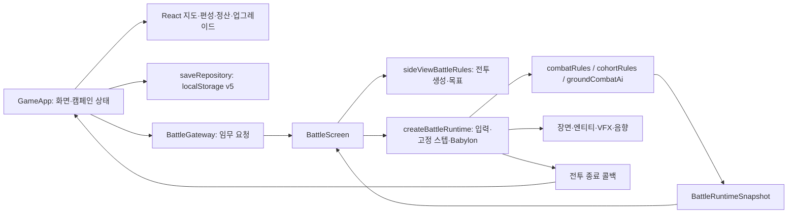

# 구조와 개발 운영

**작성일: 2026-08-27 · 최종 수정일: 2026-08-27**

**변경 이력**

| 날짜 | 구분 | 내용 |
| --- | --- | --- |
| 2026-08-27 | 수정 | 작성일·최종 수정일·변경 이력 추가 |
| 2026-08-27 | 작성 | 코드 구조·저장 계약·Editor 안전 절차·검증 명령 정리 |

기준: 2026-08-27 / `084d4c3`. [문서 안내](README.md) · [전투 규칙](BATTLE.md) · [검증 기록](AUDIT.md)

## 1. 실행 구조와 코드 탐색

Next.js 16.2.6, React 18.2, Babylon.js 9.12.1, TypeScript 5.9.3. 캠페인은 브라우저에서 실행되며 게임용 API 서버·계정·클라우드 저장은 없다. 버전의 실제 기준은 [package.json](../package.json)과 [package-lock.json](../package-lock.json)이다.



| 찾을 내용 | 시작 파일 / 책임 |
| --- | --- |
| 앱 진입·전체 화면 흐름 | [page.tsx](../src/app/page.tsx), [GameApp.tsx](../src/game/GameApp.tsx) |
| 도메인 계약·기본값 | [types.ts](../src/game/domain/types.ts), [balance.ts](../src/game/domain/balance.ts) |
| 캠페인 초기화·성장·정산 | [campaignRules.ts](../src/game/domain/campaignRules.ts) |
| 편성·비용·여행 | [logisticsRules.ts](../src/game/domain/logisticsRules.ts), [travelRules.ts](../src/game/domain/travelRules.ts) |
| 점령·주둔·포로 변환 | [missionRules.ts](../src/game/domain/missionRules.ts), [conversionRules.ts](../src/game/domain/conversionRules.ts) |
| 업그레이드 정의·선행 조건 | [upgradeCatalog.ts](../src/game/domain/upgradeCatalog.ts), [upgradeTree.ts](../src/game/domain/upgradeTree.ts) |
| 세계·도시 | [world/index.ts](../src/game/data/world/index.ts), [playableCities.ts](../src/game/data/playableCities.ts) |
| 엔진에 넘기는 전투 요청 | [BattleGateway.ts](../src/game/battle/BattleGateway.ts) |
| 지도와 규칙 선택 | [battleSetupRules.ts](../src/game/battle/gameplay/battleSetupRules.ts), [battleMapCatalog.ts](../src/game/battle/maps/battleMapCatalog.ts) |
| 2D 배치·자원 지속성 | [generateAbsorbableClusters.ts](../src/game/battle/gameplay/generateAbsorbableClusters.ts), [sideViewResourcePools.ts](../src/game/battle/gameplay/sideViewResourcePools.ts) |
| 전투 실행·HUD | [createBattleRuntime.ts](../src/game/battle/runtime/createBattleRuntime.ts), [BattleScreen.tsx](../src/game/battle/BattleScreen.tsx) |
| 흡수·능력·방공·적탄 | [combatRules.ts](../src/game/domain/combatRules.ts) |
| 지상 자동 AI | [groundCombatAi.ts](../src/game/domain/units/groundCombatAi.ts), [groundAttackPositioning.ts](../src/game/domain/units/groundAttackPositioning.ts), [cohortAiRules.ts](../src/game/battle/gameplay/cohortAiRules.ts) |
| 방공호·피난·군중 | [shelterRules.ts](../src/game/domain/shelterRules.ts), [BattleFleeingCrowdVisuals.ts](../src/game/battle/runtime/BattleFleeingCrowdVisuals.ts) |
| 시각 효과 | [runtime/](../src/game/battle/runtime/)의 `Battle*Vfx`, `BattleEntityVisuals`, `BattleMothershipDestructionSequence` |
| 번역·음향 | [i18n/](../src/game/i18n/), [audio/](../src/game/audio/) |

### 지켜야 할 경계와 현행 예외

도메인 규칙은 Babylon 메시에 의존하지 않고 테스트할 수 있어야 한다. 시각 맵 ID와 게임플레이 프로필 ID를 분리한다. 도시의 영속 상태는 캠페인, 한 전투의 상태는 `CombatState`, 메시는 표시 책임을 가진다.

현행 예외로 `BattleFleeingCrowdVisuals`가 실제 흡수 대상을 등록하고 X 위치도 변경한다. 따라서 도메인 세션만 만든 테스트에는 실제 런타임의 군중 25,000 단위가 없다. 자원 검증에서는 두 경로를 모두 확인해야 한다. [SYS-003](GAPS.md#sys-003)

구형 `tacticalPresets`, 자유 전술 이동, 수동 Scan·실드 충전, `applyCombatResult`, 일부 `AppScreen` 타입은 보존 코드다. 일부 템플릿 데이터는 재사용하지만 과거의 전체 전투 흐름이 살아 있는 것은 아니다. 예전 ADR의 ‘전투는 unavailable gateway’ 설명은 현행에 적용하지 않는다.

## 2. 저장 계약

[saveRepository.ts](../src/game/infrastructure/persistence/saveRepository.ts)가 유일한 캠페인 저장소다.

| 항목 | 현행 계약 |
| --- | --- |
| 키 / 버전 | `they-call-it-earth.prototype.save.v1` / 내부 `schemaVersion: 5` |
| 주요 상태 | 자원·모선·도시·업그레이드·코호트·보급·편성·이동·미정산 결과 |
| 도시 상태 | 시설 체력/파괴, 종류별 자원 풀, 기존 흡수 대상 기록, 저항·돌파·점령·주둔 |
| 임무 배치 | `mapId`, 프로필 ID/버전, `layoutSeed`. 버전 숫자로 예전 프로필 구현을 다시 불러오는 레지스트리는 없음 |
| v1~v4 읽기 | 검증 성공 시 v5로 이행. 원문은 `.preMigrationV1`~`.preMigrationV4` 키에 최초 한 번 보존 |
| 손상·스키마 불일치 | 원문을 `.corruptSave`에 보존하고 `null` 반환. 복구 UI 없음 |
| 쓰기 검증 | `saveCampaign`은 JSON 직렬화 후 저장. 쓰기 전 스키마 검증 없음 |
| 참조 보정 | 누락 도시 보충, 주둔·병력 참조 및 중복 정리, 편성/이동 관계 보정 |
| 저장하지 않는 것 | 전투 중 전체 스냅샷·입력·카메라·일시정지·현재 화면·지도 팬/줌 |

이동은 50ms 주기로 저장하며 전투는 종료 시 저장한다. 새로고침으로 현재 전투를 이어서 재현하는 기능은 없다. `localStorage.getItem/setItem` 실패·용량 초과·비활성 저장소에 대한 사용자 안내도 없다.

**주의:** `cohort-conditioning`으로 만든 전력 108~124는 읽기 스키마의 100 상한과 충돌한다. 손상으로 판정됐다고 새 게임으로 덮기 전에 원문을 보존해야 한다. [SYS-001](GAPS.md#sys-001)

## 3. 에디터·원본·배포 파일 구분

| 계층 | 위치 | 역할 |
| --- | --- | --- |
| 에디터 프로젝트 | [project.bjseditor](../project.bjseditor) | 마지막 씬·압축 옵션 등 프로젝트 설정 |
| 편집 원본 | [assets/battlescene.scene/](../assets/battlescene.scene/), [assets/battlescene/](../assets/battlescene/) | 모델·메시·재질·이미지 원본 |
| 웹 패키지 | [public/scene/battlescene.babylon](../public/scene/battlescene.babylon), [public/assets/runtime/battlescene/](../public/assets/runtime/battlescene/) | 브라우저가 읽는 산출물 |
| 런타임 보정 | [createBattleRuntime.ts](../src/game/battle/runtime/createBattleRuntime.ts) | 부모 복원·위치·카메라·파랄랙스·이동·전투·VFX |
| 아트 작업 원본 | [art-source/](../art-source/) | River/Desert/Night 등 이미지 마스터·제작 메모 |
| 최초 씬 생성기 | [create-battle-editor-scene.mjs](../scripts/create-battle-editor-scene.mjs) | 원본 씬과 프로젝트 구조를 다시 작성하는 도구. 단순 패키징 아님 |

현재 런타임은 `/scene/battlescene.babylon`을 15초 제한으로 로드하고 `SkyRootPlane` 등 필수 구조를 확인한다. 맵 manifest는 필드를 검사하며 fetch 실패 시 카탈로그 기본값을 쓴다. 장면 자체의 실패는 오류로 처리하며 가짜 전투로 대체하지 않는다.

### 명령의 차이

| 명령 | 실제 변경 범위 / 사용 시점 |
| --- | --- |
| `npm run generate` | 일반 Editor pack. 두 battle 원본 폴더를 임시 제외한 뒤 `finally`에서 복원. 현재 배틀을 갱신하는 용도로 사용하지 않음 |
| `npm run generate:battle` | 전체 pack → 생성된 script import 정규화 → 배틀 런타임 에셋 사본 재동기화 → physics 비활성 정규화 |
| `npm run generate:battle:biomes` | River/Desert 마스터에서 파랄랙스 레이어 생성 |
| `npm run generate:battle:night` | Night 아트 생성·처리 |
| `npm run generate:shelter-assets` | 방공호 이미지 처리 |
| `node scripts/create-battle-editor-scene.mjs` | **원본 재생성. 기존 씬을 삭제·다시 만들 수 있으므로 계층 정리나 리팩터링 목적으로 실행 금지** |

[pack-editor.mjs](../scripts/pack-editor.mjs)는 Editor CLI의 ESM 진입 문제를 피해 pack 모듈을 직접 호출한다. `physicsEnabled=false` 정규화는 브라우저의 구형 CANNON 참조 오류를 막는 기존 조치다. pack은 프로젝트 전체·생성 파일에도 영향을 줄 수 있어 diff 확인이 필요하다. 문서 수정·규칙 수정에는 자동으로 pack을 돌리지 않는다.

### 모선 계층 작업의 필수 안전 절차

이전 계층 정리에서 모선 일부·배경이 사라진 이력이 있다. 그때의 복구 절차는 다음 원칙으로 유지한다.

1. 사용자 미저장 Editor 상태와 git 변경을 확인하고 원본·패키지·프로젝트를 모두 백업한다.
2. 분리한 복사본에서 **무변경 저장 → 다시 열기 → pack** 왕복을 먼저 검증한다.
3. 생성기를 실행하거나 모든 `parentId`를 제거하지 않는다. 한 그룹씩 변경한다.
4. 모선 59개 파트의 이름·수·기하·UV·재질·월드 행렬·바운딩박스·스케일·소켓을 전후 비교한다.
5. 모선 외에 7개 배경 루트/평면과 구름을 포함해 원본·패키지 양쪽의 누락을 검사한다.
6. Editor 재열기, 낮·밤 전투, 1280×720과 다른 화면비, 좌우 이동·흡수·피격·대파를 확인한다.

런타임은 부모가 없는 `mothership-*` 파트를 visual root 아래로 복원하고, 존재하는 model root와 gameplay root를 구분한다. 이미 잘못된 부모가 붙은 메시까지 자동 교정하지 않는다. 에디터의 로컬 위치와 런타임 월드 Y=16.5를 섞어 보정하면 안 된다.

## 4. 아트·성능·독립 실행

고정 측면 장면은 여러 깊이의 배경 이미지, 모선 메시, 지상 스프라이트, 전투기, 풀링 VFX를 조합한다. 원본 이미지의 알파·여백·바닥 기준선·그림자·레이어 순서가 계약에 해당한다. 임시 재사용 아트가 있으므로 이미지 존재만으로 최종 에셋 완료로 판정하지 않는다.

- `city-day`, `city-night`, `river-day`, `desert-day` 네 시각 맵이 등록돼 있다. 정상 도시 연결의 임시 대체는 [CAMPAIGN](CAMPAIGN.md)에 명시했다.
- `compressedTexturesEnabled=false`. 현재 WebP 경로이며 KTX2는 도구 확인·파일 생성·브라우저 fallback 검증 전까지 선택적 후속 작업이다.
- 런타임 texture quality는 `high`를 사용한다. 플레이어 품질 전환 UI는 없다.
- 데스크톱 60FPS / 모바일 30FPS는 과거 계획의 목표이며 이번 조사에서 측정한 보증값이 아니다. 다운로드·VRAM·draw call 예산은 실측 후 다시 정해야 한다.
- 전투기 잔상 수정은 `autoClear`와 후처리의 색/깊이 초기화를 포함한다. 해결된 과거 이슈이며 새 효과를 추가할 때 회귀 검증한다.
- 대파는 공중 폭발·지면 폭발·파편·불길·연기를 조합하며 텍스처 실패 시 대체 표현을 가진다. 형제 프로젝트의 절대 경로·심볼릭 링크에 의존시키지 않는다. 현재 작업 저장소 내부 에셋과 코드가 실행 기준이다.

`docs/reference_images/`, `assets/README.md`, `art-source` 하위 제작 README는 그대로 유지한다. 전자는 참고 이미지, 후자는 에셋 출처·제작 계약이며 활성 게임 사양 문서와 역할이 다르다.

## 5. 디버그와 테스트

### 개발 실행

CI 기준 Node 24와 lockfile을 사용한다.

```bash
npm ci
npm run dev
npm run typecheck
npm run test
npm run build
```

`npm run check`는 typecheck → test → build, `check:full`은 추가로 lint → 대표 브라우저 E2E를 수행한다. lint 실패는 build 성공으로 덮이지 않는다. 이번 결과는 [AUDIT](AUDIT.md)에 있다.

### 개발용 전투 진입

개발 서버에서 `/?debug=battle&city=seoul`로 별도 디버그 캠페인을 시작한다. 필요하면 `map=river-day`, `battle-fast=1`, `battle-debug=1`을 조합한다. 쿼리 파싱은 [BattleDebug.ts](../src/game/battle/gameplay/BattleDebug.ts), 저장 격리는 `GameApp`을 확인한다.

- fast는 생존 제한 0초·철수 0.5초 등 검증용 값을 쓴다. 정상 75초 전투의 밸런스 검증으로 취급하지 않는다.
- debug controls일 때 1/2 피격, 3 지상 파괴, 4 전투기 파괴, Q 회피 연출, C 추락 등의 검증 키가 있다.
- `SHOW_IN_BATTLE_DEBUG_CONTROLS=false`로 일반 디버그 패널은 숨겨져 있다. 모선 무적 스위치는 디버그 세션에서 별도 허용한다.
- production은 위 쿼리 기반 디버그 옵션을 무시한다. 다만 `window.render_game_to_text`, `window.advanceTime` 설치는 별도 production 가드가 없다. 모든 테스트 훅이 production에서 제거된다고 설명하면 안 된다.
- `advanceTime`은 고정 스텝 자동 진행 모드로 전환한다. 실제 시간 측정·수동 플레이와 혼용하지 않는다.

### 검증 명령과 범위

| 명령 | 범위 |
| --- | --- |
| `npm test` | 도메인·지도·키보드·음향·저장 등 Vitest. 모든 HUD/웹GL 경로를 검증하지는 않음 |
| `npm run lint` | 전체 ESLint. `.vercel/output`이 제외되지 않아 로컬 생성 파일까지 잡힐 수 있음 |
| `npm run test:e2e:side-view` | 개발 서버 3010의 9개 실행(모바일 2크기 포함), build 후 production 3011의 디버그 차단 검사. 서버 자동 정리 |
| `npm run test:e2e:ground-positioning` | 지상 사격 위치 |
| `npm run test:e2e:absorption-v2` | 빔 V2 |
| `npm run test:e2e:absorption-virtual-objects` | 빔 내부 흡수 오브젝트 |
| `npm run test:e2e:cohort-human-drop` | 인간 강하 **연출**. 병력 편성·전투 검증과 다름 |
| `npm run test:e2e:selective-battle-audio` | 선택된 효과음 |
| `npm run test:e2e:fleeing-crowd-absorption` | 외부 군중 흡수 |
| `npm run test:e2e:civilian-shelters` | 시민·방공호 |
| `npm run test:e2e:fighter-ghosting` | 전투기 프레임 잔상 |
| `npm run check:battle:compression` | 인코더 설치 여부만 확인. 압축 텍스처의 실제 렌더링 검증이 아님 |

각 단독 E2E의 서버·출력·브라우저 변수는 [scripts/](../scripts/)의 해당 파일에서 확인한다. 대표 실행기는 `SIDE_VIEW_BROWSER_EXECUTABLE` 지정값 → 설치된 Chrome/Chromium 후보 → Playwright 기본 순서로 브라우저를 고른다. ‘항상 번들 Chromium’이라는 이전 설명은 부정확했다.

이번 감사는 대표 E2E 전체·Editor 왕복·장기 성능·실기기 모바일을 실행하지 않았다. 기존 계획서의 과거 통과 기록은 이번 검증 결과로 전용하지 않는다.
